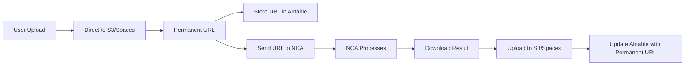

# YouTube Video Engine - File Persistence Issue Analysis

## Problem Summary

The YouTube Video Engine is experiencing multiple critical issues:

1. **File Deletion After ~24 Hours**: Files uploaded to Airtable become inaccessible with error "Your browser does not support this video format or video encoding"
2. **Webhook Delivery Failures**: NCA Toolkit webhooks are not reaching the application
3. **Long Processing Delays**: What should take seconds/minutes is taking hours
4. **Stuck Jobs**: Combination jobs remain in "processing" state indefinitely

## Root Cause Analysis

### 1. Temporary File URLs
The error message shows: `c45e9692-5e5b-4b63-995f-b4d515146f6b_output_0.mp4`

This appears to be a temporary file that's being deleted after processing. The issue is likely:
- NCA Toolkit stores files temporarily
- Files are deleted after a certain period (appears to be ~24 hours)
- Airtable tries to download these files but they're already gone

### 2. Webhook Infrastructure Failure
From the logs:
- Webhooks are registered correctly
- Jobs are created successfully
- But webhook callbacks never arrive
- This leaves jobs in "processing" state forever

### 3. Architecture Flaw
Current flow:
```
1. Upload to Airtable → Airtable stores URL reference
2. Send URL to NCA → NCA processes file
3. NCA returns temporary URL → Stored in Airtable
4. Airtable tries to download → File may be deleted by then
```

## Immediate Solutions

### 1. Implement Permanent Storage
```python
# In services/nca_service.py, after receiving NCA output:
def handle_nca_output(nca_output_url, segment_id):
    # Download the file immediately
    response = requests.get(nca_output_url)
    
    # Upload to permanent storage (DigitalOcean Spaces)
    permanent_url = upload_to_spaces(
        file_data=response.content,
        filename=f"segment_{segment_id}_combined.mp4"
    )
    
    # Update Airtable with permanent URL
    airtable.update_segment(segment_id, {
        'Combined': [{'url': permanent_url}]
    })
```

### 2. Add Webhook Retry & Polling
```python
# Add to api/webhooks.py
@scheduler.scheduled_job('interval', minutes=5)
def check_stuck_jobs():
    # Find jobs older than 10 minutes still processing
    stuck_jobs = airtable.get_stuck_jobs(minutes=10)
    
    for job in stuck_jobs:
        # Try to get status from NCA
        nca_status = check_nca_job_status(job['external_id'])
        
        if nca_status and nca_status.get('status') == 'completed':
            # Process as if webhook was received
            process_job_completion(job, nca_status)
```

### 3. Fix Webhook Registration
```python
# Ensure webhook URL is publicly accessible
# Check if behind firewall/proxy
# Verify SSL certificates are valid
```

## Long-term Solutions

### 1. Redesign File Storage Architecture



### 2. Implement Robust Job Management

```python
class JobManager:
    def __init__(self):
        self.redis_client = redis.Redis()
    
    def create_job(self, job_data):
        # Store job in Redis with TTL
        job_id = str(uuid.uuid4())
        self.redis_client.setex(
            f"job:{job_id}",
            timedelta(hours=24),
            json.dumps(job_data)
        )
        
        # Schedule timeout check
        self.schedule_timeout_check(job_id, minutes=30)
        
        return job_id
    
    def check_job_status(self, job_id):
        # Check multiple sources
        # 1. Redis cache
        # 2. Airtable
        # 3. NCA API
        # 4. S3/Spaces
```

### 3. Add Comprehensive Monitoring

```python
# monitoring.py
import sentry_sdk
from prometheus_client import Counter, Histogram

webhook_received = Counter('webhook_received_total', 'Total webhooks received')
job_duration = Histogram('job_duration_seconds', 'Job processing duration')
file_upload_errors = Counter('file_upload_errors_total', 'File upload errors')

def monitor_job(job_id):
    start_time = time.time()
    
    try:
        # Process job
        result = process_job(job_id)
        job_duration.observe(time.time() - start_time)
        return result
    except Exception as e:
        file_upload_errors.inc()
        sentry_sdk.capture_exception(e)
        raise
```

## Immediate Action Items

1. **Deploy File Persistence Fix**
   - Modify webhook handler to download and re-upload files immediately
   - Use DigitalOcean Spaces for permanent storage
   
2. **Implement Job Polling**
   - Check stuck jobs every 5 minutes
   - Manually process completed jobs
   
3. **Add Monitoring**
   - Log all webhook attempts
   - Track file upload/download success rates
   - Alert on stuck jobs

4. **Test Webhook Connectivity**
   - Verify Fly.io app is publicly accessible
   - Check for any firewall/proxy issues
   - Test with webhook.site to confirm delivery

## Configuration Changes Needed

```env
# Add to .env
SPACES_ACCESS_KEY=your_access_key
SPACES_SECRET_KEY=your_secret_key
SPACES_BUCKET_NAME=your-bucket-name
SPACES_REGION=nyc3
SPACES_ENDPOINT=https://nyc3.digitaloceanspaces.com

# Redis for job management
REDIS_URL=redis://localhost:6379

# Monitoring
SENTRY_DSN=your_sentry_dsn
```

## Testing Plan

1. **Test File Persistence**
   ```bash
   # Upload a test file
   # Wait 24 hours
   # Verify file is still accessible
   ```

2. **Test Webhook Delivery**
   ```bash
   # Use ngrok for local testing
   # Send test webhook from NCA
   # Verify receipt
   ```

3. **Test Job Recovery**
   ```bash
   # Create a job
   # Simulate webhook failure
   # Verify polling picks it up
   ```

## Timeline

- **Today**: Deploy file persistence fix
- **Tomorrow**: Add job polling
- **This Week**: Full monitoring implementation
- **Next Week**: Architecture redesign if needed

This should resolve the immediate issues while providing a path to a more robust solution.